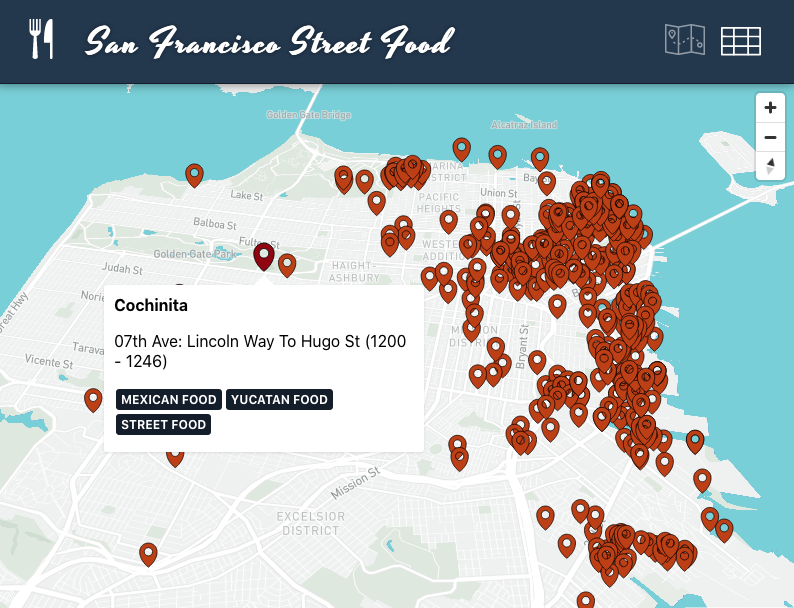

# San Francisco Street Food Map

> A demo street food map using React, TypeScript and Mapbox GL

This is a demo app I created using React, TypeScript and Mapbox GL (`react-map-gl`) to render data on a map. The street food data I used comes from [DataSF's Mobile Food Facility Permit data](https://data.sfgov.org/Economy-and-Community/Mobile-Food-Facility-Permit/rqzj-sfat). Feel free to browse the code, try the live app, or fork the repo.

## Available Scripts

In the project directory, you can run:

### `yarn start`

Runs the app in the development mode. 
Open [http://localhost:3000](http://localhost:3000) to view it in the browser.

The page will reload if you make edits. 
You will also see any lint errors in the console.

### `yarn test`

Launches the test runner in the interactive watch mode.

### `yarn build`

Builds the app for production to the `build` folder.
